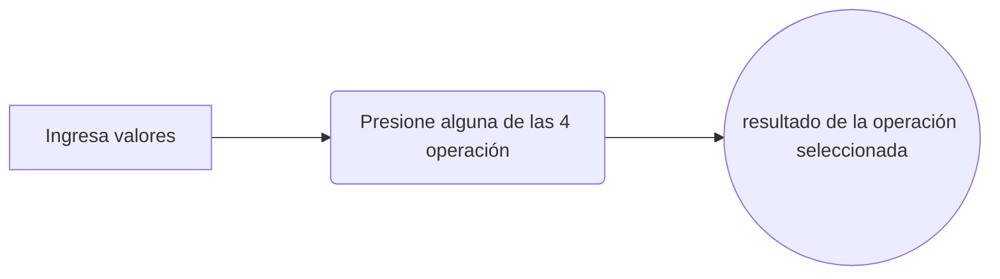

#                                       **💁**

#   Un simple programa de prácticas, Operaciones básicas en una calculadora con estilos.

## html,css y javacript

```mermaid
graph LR
A[Ingresa valores] ---> B( Presione alguna de las 4 operación )
B ---> D((resultado de la operación seleccionada))

```
